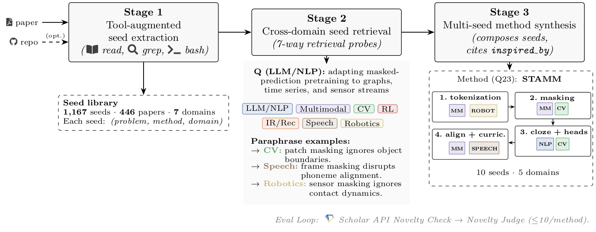

# PaperGym

ML idea-synthesis systems typically retrieve prior work from the same subfield as the query. PaperGym evaluates a different stance: paraphrase the query into each of 7 ML domains, retrieve mechanism seeds grounded in each domain, and synthesize a method that explicitly cites which mechanism it borrowed from where.

Each paper becomes an interactive environment: a tool-augmented agent (read / grep / bash inside Docker, plus optional `git clone` of the paper's code repo) explores the paper, then distills 1–3 mechanism seeds. The released library has 1,167 seeds across 446 papers and 7 ML domains.



## Setup

Install [uv](https://github.com/astral-sh/uv) if you don't have it:

```bash
curl -LsSf https://astral.sh/uv/install.sh | sh
```

Then set up the project environment:

```bash
uv venv .venv --python 3.11
uv pip install -e ".[dev]"
source .venv/bin/activate
cp .env.examples .env
```

Edit `.env` to set the required environment variables:

| Variable | Used for |
|---|---|
| `LITELLM_MODEL` | Generator model (e.g., `gpt-5`) |
| `JUDGE_MODEL` | Judge model in a different family (e.g., `anthropic/claude-sonnet-4-6`) |
| `EMBEDDING_MODEL` | Embedding model (e.g., `text-embedding-3-small`) |
| `OPENAI_API_KEY` / `ANTHROPIC_API_KEY` | Provider keys for the models above |

Host requirements: Docker daemon (only for Bootstrap). The Accumulator runs inside Docker (one container per paper); orchestration and synthesis run on the host.

## Run

End-to-end paper pipeline (assumes the seed library is already built; see [Bootstrap](#bootstrap) for the library-building step):

```bash
bash scripts/reproduce_paper.sh
```

Each stage writes a timestamped run directory under `data/eval/`.

Both the generator (`LITELLM_MODEL`) and the independent judge (`JUDGE_MODEL`) are read from `.env`. The judge must be in a different model family from the generator for self-bias control; the `.env.examples` defaults pair a GPT-5 generator with a Sonnet 4.6 judge.

The script runs Stages 2, 3, and the novelty iteration loop. The Stage 1 *no-tool extraction baseline* is in the [`PaperGym_notool`](https://github.com/yunjoochoi/PaperGym_notool) companion repo; the Stage 1 rubric judges (`seed_quality_eval.py`, `seed_shuffled.py`) are in this repo and consume both libraries — see [`docs/REPRODUCE.md`](docs/REPRODUCE.md#stage-1--tool-augmented-seed-extraction-section-32).

### Bootstrap

A pre-built library ships at [`data/library/`](data/library/) (1,167 seeds across 446 papers). Skip the rest of this section if you just want to test idea synthesis based on the pre-built library.

One-time library build from arxiv:

```bash
bash scripts/build_image.sh                                          # Build paper-sandbox Docker image
uv run python scripts/sample_envs.py --out data/arxiv_ids.jsonl   # arxiv id list
uv run python scripts/run_accumulator.py \
    --arxiv-ids data/arxiv_ids.jsonl \
    --library-root data/library \
    --events-dir data/events
```

Per-domain sampling defaults are in `scripts/sample_envs.py` (`DEFAULT_BUDGET`); override with `--budget-per-domain N`. The Accumulator investigates paper repos inside Docker and wipes the container on exit; only the extracted seeds and event traces persist on the host.

## Code layout

```
PaperGym/
├── src/papergym/                       # Core library
│   ├── env/                            # Paper sandbox (Docker per paper as env)
│   ├── library/                        # FAISS seed store (sharded)
│   ├── agents/
│   │   ├── accumulator/                # Stage 1: tool-augmented extractor
│   │   ├── paraphraser/                # Stage 2: 7-domain reframer
│   │   └── synthesizer/                # Stage 3: multi-seed synthesizer
│   ├── tools/                          # read / grep / bash for accumulator
│   ├── domain.py                       # 7 ML domains + S2 field mapping
│   └── llm.py                          # litellm provider-agnostic wrapper
│
├── eval/                               # Rubrics + judges per stage
│   ├── seed_quality/                   # Stage 1: specificity, grounding
│   ├── retrieval/                      # Stage 2: relevance
│   └── ideation/                       # Stage 3: novelty, validity, coherence.
│
├── scripts/                            # Entry points
│   ├── reproduce_paper.sh              # single command, full pipeline
│   ├── sample_envs.py                  # bootstrap arxiv ids
│   ├── run_accumulator.py              # launch sandbox per paper
│   ├── seed_quality_eval.py            # Stage 1: seed quality rubrics
│   ├── seed_shuffled.py                # Stage 1: negative grounding control
│   ├── retrieval_eval.py               # Stage 2 runner
│   ├── ideation_eval.py                # Stage 3 single pass A/B/C/D
│   ├── ideation_layers_eval.py         # Stage 3 pairwise novelty/validity
│   ├── coherence_pairwise_eval.py      # Stage 3 pairwise coherence
│   ├── coherence_per_condition_eval.py # Stage 3 single pass coherence
│   ├── inspired_by_grounding_eval.py   # Stage 3 attribution
│   └── loop_benchmark.py               # novelty iteration ablation
│
├── data/
│   ├── queries.yaml                    # 30 evaluation queries
│   ├── library/                        # seed library (1,167 seeds / 446 papers)
│   ├── events/                         # per-paper accumulator traces
│   └── eval/                           # evaluation outputs (timestamped)
│
├── docker/Dockerfile                   # Accumulator sandbox
└── tests/                              # pytest unit tests
```

## Custom queries

```python
from pathlib import Path
from eval.ideation import run_condition_c
from papergym.library import LibraryStore
from papergym.llm import LLMClient

library = LibraryStore.open_merged(Path("data/library"))
out = run_condition_c(query="long-context efficient inference",
                      library=library, llm=LLMClient(),
                      natural_domain="LLM_NLP", k_per_domain=3)
print(out.method, out.inspired_by)
```

`LibraryStore.open_merged` auto-detects sharded subdirs. The query is paraphrased into 7 domain reframings, top-k seeds retrieved per paraphrase, and the synthesizer composes a method with per-seed `borrowed_aspect`.

## License

Apache License 2.0. See [`LICENSE`](LICENSE) for details.
