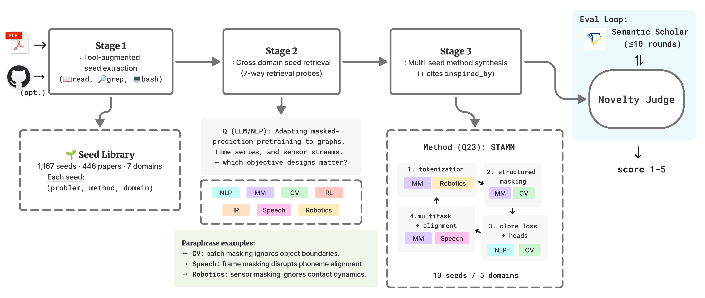

# PaperGym

PaperGym treats each ML paper as an interactive environment — a *gym* — for an LLM agent to investigate. A tool-augmented agent (read / grep / bash inside Docker, plus optional `git clone` of the paper's code repo) explores each paper and distills 1–3 mechanism seeds. The released library has 1,167 seeds across 446 papers and 7 ML domains.

ML idea-synthesis systems typically retrieve prior work from the same subfield as the query. On top of this library, PaperGym evaluates a different stance: paraphrase the query into each of 7 ML domains, retrieve mechanism seeds grounded in each domain, and synthesize a method that explicitly cites which mechanism it borrowed from where.



Jump to [Quick start](#quick-start) to run it on your own query.

## Setup

Set up the project environment:

```bash
uv venv .venv --python 3.11
uv sync
source .venv/bin/activate
cp .env.examples .env
```

Edit `.env` to set the required environment variables:

| Variable | Used for |
|---|---|
| `LITELLM_MODEL` | Generator model. |
| `JUDGE_MODEL` | Judge model in a different family from the generator. |
| `EMBEDDING_MODEL` | Embedding model (`text-embedding-3-small`) |
| `OPENAI_API_KEY` / `ANTHROPIC_API_KEY` | Provider keys. Set whichever your `LITELLM_MODEL` / `JUDGE_MODEL` / `EMBEDDING_MODEL` route to (litellm picks by model prefix) |
| `OPENAI_API_BASE` | Optional. override OpenAI-compatible endpoint |
| `S2_API_KEY` | Optional. Semantic Scholar bulk-search key, used by `scripts/sample_envs.py` (Bootstrap) and the novelty-loop reference check |

Host requirements: Docker daemon (only for Bootstrap). The Accumulator runs inside Docker (one container per paper); orchestration and synthesis run on the host.

## Quick start

```python
from dotenv import load_dotenv; load_dotenv()
from pathlib import Path
from eval.ideation import run_condition_c
from papergym.library import LibraryStore
from papergym.llm import LLMClient

query = "How can we serve long-context LLMs efficiently at inference time?"

library = LibraryStore.open_merged(Path('data/library'))
out = run_condition_c(query=query, library=library, llm=LLMClient(),
                      natural_domain='LLM_NLP', k_per_domain=3)
print('METHOD:', out.method)
print('INSPIRED_BY:', out.inspired_by)
```

`LibraryStore.open_merged` auto-detects sharded subdirs. The query is paraphrased into 7 domain reframings, top-k seeds retrieved per paraphrase, and the synthesizer composes a method with per-seed `borrowed_aspect`.

Baseline comparison (condition A, no retrieval, problem-only) on the same query:

```python
from dotenv import load_dotenv; load_dotenv()
from eval.ideation import run_condition_a
from papergym.llm import LLMClient

query = "How can we serve long-context LLMs efficiently at inference time?"

base = run_condition_a(query=query, llm=LLMClient())
print('METHOD:', base.method)
```

## End-to-end reproduction

The commands below are sufficient to rerun the paper results from the
released artifacts. The tool-augmented seed library lives in
[`data/library/`](data/library/); the no-tool Stage 1 baseline library lives
in [`papergym_notool/data/library/`](papergym_notool/data/library/).
Library generation is provenance, not part of the default reproduction path.
See [Bootstrap](#bootstrap) only if you want to rebuild the tool-augmented
library from arXiv.

### Stage 1: seed extraction quality

Stage 1 compares two existing libraries: `A` is direct no-tool extraction
(full `paper.md` in one LLM turn), and `C` is the tool-augmented accumulator.
The rubric judges need the converted paper markdown cache used for grounding
checks.

```bash
PAPERS_CACHE=${PAPERS_CACHE:-data/papers_cache}
JUDGE=${JUDGE_MODEL}

uv run python scripts/seed_quality_eval.py \
  --library A=papergym_notool/data/library \
  --library C=data/library \
  --papers-cache "$PAPERS_CACHE" \
  --judge-model "$JUDGE"

STAGE1_RUN=$(ls -td data/eval/[0-9]* | head -1)

uv run python scripts/seed_shuffled.py \
  --judgements "$STAGE1_RUN/judgements.jsonl" \
  --library A=papergym_notool/data/library \
  --library C=data/library \
  --papers-cache "$PAPERS_CACHE" \
  --judge-model "$JUDGE"
```

### Stages 2 and 3

The full Stage 2/3 reproduction script reruns retrieval, ideation,
pairwise/per-condition judges, attribution judging, and the novelty iteration
loop:

```bash
bash scripts/reproduce_paper.sh
```

Each stage writes a timestamped run directory under `data/eval/`. Existing
released run directories are kept untouched.

The README is the canonical reproduction entry point. [`docs/REPRODUCE.md`](docs/REPRODUCE.md)
is an optional claim-by-claim ledger that maps paper claims to scripts,
output files, and JSON fields.

Both the generator (`LITELLM_MODEL`) and the independent judge (`JUDGE_MODEL`) are read from `.env`. The judge must be in a different model family from the generator for self-bias control; the `.env.examples` defaults pair a GPT-5 generator with a Sonnet 4.6 judge.

### Bootstrap

A pre-built library ships at [`data/library/`](data/library/) (1,167 seeds across 446 papers). Skip the rest of this section if you just want to test idea synthesis based on the pre-built library.

One-time library build from arxiv:

```bash
bash scripts/build_image.sh                                          # Build paper-sandbox Docker image
uv run python scripts/sample_envs.py --out data/arxiv_ids.jsonl   # arxiv id list
uv run python scripts/run_accumulator.py \
    --arxiv-ids data/arxiv_ids.jsonl \
    --library-root data/library \
    --events-dir data/events
```

Per-domain sampling defaults are in `scripts/sample_envs.py` (`DEFAULT_BUDGET`); override with `--budget-per-domain N`. The Accumulator investigates paper repos inside Docker and wipes the container on exit; only the extracted seeds and event traces persist on the host.

## Code layout

```
PaperGym/
├── src/papergym/                       # Core library
│   ├── env/                            # Paper sandbox (Docker per paper as env)
│   ├── library/                        # FAISS seed store (sharded)
│   ├── agents/
│   │   ├── accumulator/                # Stage 1: tool-augmented extractor
│   │   ├── paraphraser/                # Stage 2: 7-domain reframer
│   │   └── synthesizer/                # Stage 3: multi-seed synthesizer
│   ├── tools/                          # read / grep / bash for accumulator
│   ├── domain.py                       # 7 ML domains + S2 field mapping
│   └── llm.py                          # litellm provider-agnostic wrapper
│
├── eval/                               # Rubrics + judges per stage
│   ├── seed_quality/                   # Stage 1: specificity, grounding
│   ├── retrieval/                      # Stage 2: relevance
│   └── ideation/                       # Stage 3: novelty, validity, coherence.
│
├── scripts/                            # Entry points
│   ├── reproduce_paper.sh              # single command, full pipeline
│   ├── sample_envs.py                  # bootstrap arxiv ids
│   ├── run_accumulator.py              # launch sandbox per paper
│   ├── seed_quality_eval.py            # Stage 1: seed quality rubrics
│   ├── seed_shuffled.py                # Stage 1: negative grounding control
│   ├── retrieval_eval.py               # Stage 2 runner
│   ├── ideation_eval.py                # Stage 3 single pass A/B/C/D
│   ├── ideation_layers_eval.py         # Stage 3 pairwise novelty/validity
│   ├── coherence_pairwise_eval.py      # Stage 3 pairwise coherence
│   ├── coherence_per_condition_eval.py # Stage 3 single pass coherence
│   ├── inspired_by_grounding_eval.py   # Stage 3 attribution
│   └── loop_benchmark.py               # novelty iteration ablation
│
├── data/
│   ├── queries.yaml                    # 30 evaluation queries
│   ├── library/                        # seed library (1,167 seeds / 446 papers)
│   ├── events/                         # per-paper accumulator traces
│   └── eval/                           # evaluation outputs (timestamped)
│
├── docker/Dockerfile                   # Accumulator sandbox
├── tests/                              # pytest unit tests
│
└── papergym_notool/                    # Stage 1 no-tool extraction baseline
    ├── src/papergym/                   # variant: direct prompting (no read/grep/bash)
    ├── scripts/                        # baseline entry points
    ├── data/library/                   # no-tool baseline seed library
    └── README.md                       # baseline setup + reproduce steps
```

## License

MIT license.
